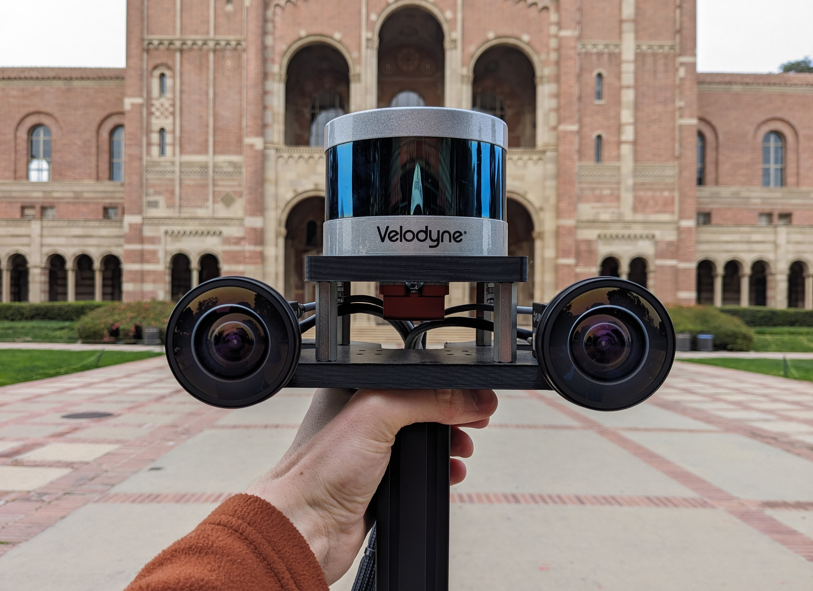
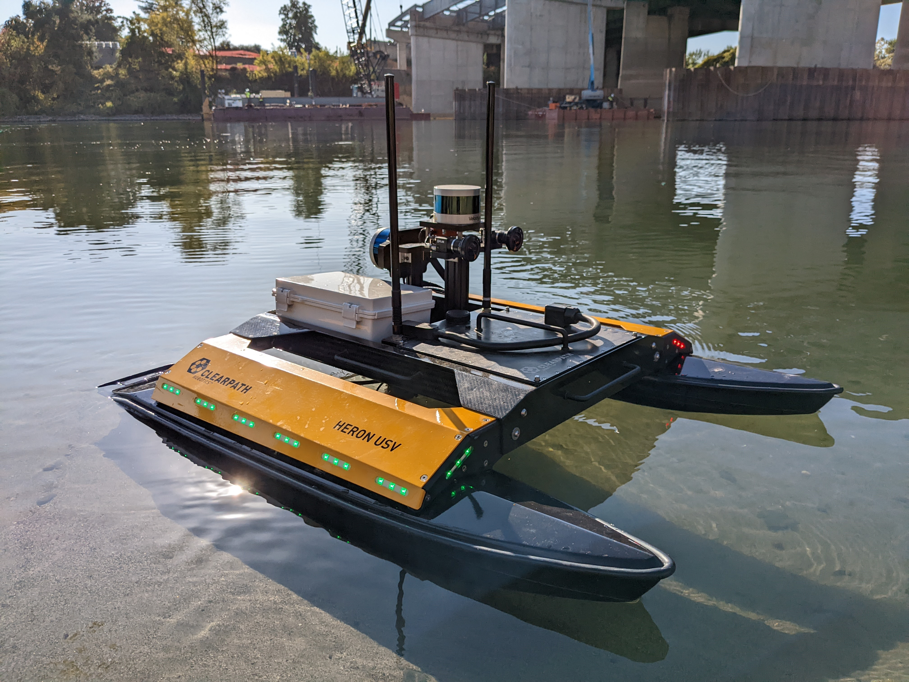

# ig-handle: a handheld inspector gadget

<br>
<p align='center'>
  <table>
    <tr>
      <td></td>
      <td></td>
      <td></td>
    </tr>
  </table>
</p>

**ig-handle** is an open-source, hardware-synchronized LiDAR-visual-inertial sensor kit consisting of:
 - One [Velodyne Puck](https://velodyneLiDAR.com/products/puck/) LiDAR
 - Two [FLIR Blackfly S USB3](https://www.flir.com/products/blackfly-s-usb3/?model=BFS-U3-13Y3M-C&vertical=machine+vision&segment=iis) monochrome cameras
 - One [Xsens MTi-30 AHRS](https://www.xsens.com/hubfs/Downloads/usermanual/MTi_usermanual.pdf) IMU

All sensors are synchronized with a [DS3231 Real Time Clock (RTC)](https://www.adafruit.com/product/3013) using a Teensy 4.1 microcontroller, which provides:
  - PPS/NMEA time-synchronization for the LiDAR (see Section 7.4 of the following [manual](https://drive.google.com/file/d/1aXXFh7Xt5NxyyPRi7TeC-lx5p7oeyu10/view?usp=sharing) for details). The PPS synchronization signal is generated by the microcontroller according to the RTC's PPS signal, which has a temperature-compensated accuracy of +/-2ppm. The LiDAR collects data at 10 Hz,
  - analog signals to start and simultaneously trigger cameras at 20 Hz, enabling stereo vision, and
  - digital signals to start and sample IMU data at 200 Hz

**ig-handle** is extensible to additional LiDARs and cameras, with the option to soft-synchronize sonar data collected by a [DT100 multibeam profiling sonar](https://imagenex.com/products/dt100) as demonstrated in our paper:
```bibtex
@article{thoms2023tightly,
  title={Tightly Coupled, Graph-Based DVL/IMU Fusion and Decoupled Mapping for SLAM-Centric Maritime Infrastructure Inspection},
  author={Thoms, Alexander and Earle, Gabriel and Charron, Nicholas and Narasimhan, Sriram},
  journal={IEEE Journal of Oceanic Engineering},
  year={2023},
  publisher={IEEE}
}
```
If you are interested in building your own **ig-handle**, the latest parts list, CAD models, electrical schematics, and build instructions can be found [here](https://drive.google.com/drive/folders/1DrAMQ9eQS1JjoDI4LWuoENaN7cZ9nRTC?usp=sharing). Note that our build uses the following [Intel NUC computer kit](https://drive.google.com/file/d/1mJj0qhpS1F2KvkGdUfzvh3qHi5qF908q/view?usp=sharing) with an 11th Gen Intel® CoreTM i7-1165G7 processor and 8GB of DDR4 RAM.

## Installation

For installation, please refer to the [Beam Installation Guide](https://github.com/BEAMRobotics/beam_robotics/wiki/Beam-Robotics-Installation-Guide). This guide covers the installation of dependencies (as required by **ig-handle** and supported robots **ig-husky** and **ig-heron**) on a clean Ubuntu 20.04 machine. We recommend setting your catkin workspace to the default directory `~/catkin_ws` as the commands documented in this README follow this convention.

## Collect Raw Data

**ig-handle** data is collected and saved to a rosbag via:
```bash
roslaunch ig_handle collect_raw_data.launch
```
By default, rosbags are recorded in a timestamped folder as `raw.bag`. Use the `output` arg to specify an alternative parent directory for the timestamped folder. For example:
```bash
roslaunch ig_handle collect_raw_data.launch output:=~/my_folder
```
This command will record data to `~/my_folder/YYYY_MM_DD_HH_MM_SS/raw.bag`. Note that, when powered on, the LiDAR takes approximately 25-30 seconds to connect over LAN. Given this, wait 30 seconds after **ig-handle** is powered on to collect raw data.

For each robot that integrates **ig-handle**, there is a launch file that starts data collection for **ig-handle** plus additional sensors (see Section **Raw Data Description** for details). These launch files are invoked with a launch argument called `robot`:

**ig-heron** adds cameras `F3` and `F4`, LiDAR `lidar_v`, and the DT100 sonar. Data is collected via:
```bash
roslaunch ig_handle collect_raw_data.launch robot:=heron
```
**ig-husky** adds cameras `F3` and `F4`, LiDAR `lidar_v`, and the Husky base and control packages. A [FLIR Boson Plus 640](https://www.flir.com/products/boson-plus/?model=22640A012&vertical=lwir&segment=oem) thermal camera is included, though is not tested. Data is collected via:
```bash
roslaunch ig_handle collect_raw_data.launch robot:=husky
```
Note that before using the launch files, create a bag directory via:
```bash
mkdir -p bags
```

### Collect Raw Data in the Field

#### ig-handle
To collect data in the field with **ig-handle**, we recommend connecting our [touch monitor](https://www.elotouch.com/touchscreen-monitors-1002l.html) through the outbound HDMI and USB ports on the handle box. Commands can be entered via the touch screen. To begin data collection, enter:
```bash
roslaunch ig_handle collect_raw_data.launch
```
Once data collection is complete, kill the terminal session via `ctrl+c`.

#### ig-husky and ig-heron
To collect data in the field with robots **ig-husky** and **ig-heron**, we recommend the following steps:
1. Connect your laptop to the handle's computer over ethernet and manually assign your laptop an ip address on the LiDAR network (ex. `192.168.1.151`).
2. SSH into the handle computer via:
    ```bash
    ssh ig-handle@192.168.1.150
    ```
    our build uses the password `beam`.

3. Start a screen session via:
    ```bash
    screen
    ```
    press `enter` to start the session.

4. Collect raw data (comment out the robot not in use)
    ```bash
    roslaunch ig_handle collect_raw_data.launch \
    robot:=husky # ig-husky
    robot:=heron # ig-heron
    ```
5. Within the same terminal, press `ctrl+a` then `ctrl+d` to detach the screen process.
6. Disconnect the ethernet cable and perform data collection.
7. Once data collection is performed, reconnect the ethernet cable to the handle computer and end the screen process via:
    ```bash
    screen -r
    ```
    You may now end the data collection process normally via `ctrl+c`.

### Raw Data Description
In order to collect data, `collect_raw_data.launch` calls `record_bag.sh` found in `ig_handle/scripts/` and records topics specific to each robot.

For **ig-handle**, the following topics are recorded:
| Topic                     | message types               |
| ------------------------- | --------------------------- |
| /F1/image_raw/compressed  | sensor_msgs/CompressedImage |
| /F2/image_raw/compressed  | sensor_msgs/CompressedImage |
| /cam/time                 | sensor_msgs/TimeReference   |
| /imu/data                 | sensor_msgs/Imu             |
| /imu/time                 | sensor_msgs/TimeReference   |
| /lidar_h/velodyne_packets | velodyne_msgs/VelodyneScan  |
| /lidar_h/velodyne_points  | sensor_msgs/PointCloud2     |
| /pps/time                 | sensor_msgs/TimeReference   |

For **ig-heron** and **ig-husky**, the following additional topics are recorded:
| Topic                     | message types               |
| ------------------------- | --------------------------- |
| /F3/image_raw/compressed  | sensor_msgs/CompressedImage |
| /F4/image_raw/compressed  | sensor_msgs/CompressedImage |
| /lidar_v/velodyne_packets | velodyne_msgs/VelodyneScan  |
| /lidar_v/velodyne_points  | sensor_msgs/PointCloud2     |

Further, **ig-heron** records `/DT100/sonar_scans` topics of message type `sensor_msgs/PointCloud2`, while **ig-husky** records `/thermal/image_raw/compressed` topics of message type `sensor_msgs/CompressedImage`. If additional topics are desired, `record_bag.sh` can be modified accordingly.

### Raw Data Processing
Raw data is processed using `scripts/process_raw_bag.py`. Its description and interface follows.

#### Description:
This script:
1. restamps camera and IMU sensor messages with their appropriate time reference messages, and
2. interpolates sonar messages against the reference PPS signal

Acknowledging camera and IMU sensor messages (i.e. `sensor_msgs/CompressedImage` and `sensor_msgs/Imu`) take longer to serialize than time reference messages (i.e. `/cam/time` and `/imu/time`), the script discards camera and IMU sensor messages before the first time reference (based on serialized time) and then proceeds to restamp sensor messages with time references using a first-in-first-out queue. In testing, we observe no camera and IMU signal dropout for periods typical for data collection (i.e. 5-10 min), permitting such a simple offline time-synchronization strategy. This script throws an error when signal dropout is detected, which may happen if connections become loose. Sometimes, dropout occurs after an extended period of data collection, and we provide an argument `--bag_end` which allows the user to process the bag *before* this dropout occurs. To see where dropout occurs, use `rosrun rqt_bag rqt_bag` to visualize the raw bag `raw.bag`. Further, the argument `--clip_restamp_topics` can be used to manually assign the time at which data and time topics are processed using a first-in-first-out queue to avoid errors in teensy startup.

#### Interface:
The script's interface is accessed via:
```bash
cd ~/catkin_ws/src/ig_handle/scripts
python3 process_raw_bag.py --help
```
The bagfile argument `--bag` needs to be set every time to find the input bag. The values for data and time topics are set correctly by default, so only specify those arguments if you have changed the data collection process. Below is an example of how to process collected raw data:
```bash
cd ~/catkin_ws/src/ig_handle/scripts
python3 process_raw_bag.py --bag ~/bags/YYYY_MM_DD_HH_MM_SS/raw.bag
```
The script will output a rosbag called `output.bag` to the same folder specified via the `--bag` argument, which can then be passed to a SLAM algorithm. Note that in testing, we observe that a warm-up time of ~5 seconds is required for the LiDAR to synch with the RTC, and therefore recommend:
```bash
cd ~/bags/YYYY_MM_DD_HH_MM_SS/
rosbag play --start=5 output.bag --pause
```
when playing back the bag for the SLAM algorithm. Pressing the `enter` key will then continue playback.

### Copy Data from Robots
Once raw data has been collected and processed according to Section **Raw Data Processing**, copy the data over to your laptop (over ethernet) via:
```bash
scp -r ~/bags/YYYY_MM_DD_HH_MM_SS user@192.168.1.XXX:~/bags/dir
```
where:
- `YYYY_MM_DD_HH_MM_SS` is the folder containing the data
- `user` is the user name for your laptop
- `192.168.1.XXX` is the ip address statically assigned to your laptop. This ip address is on the same subnet as the LiDAR network.
- `~/bags/dir` is the directory on your laptop where you would like to copy the data
for example:
```bash
scp -r ~/bags/2023_10_15_03_56_54 alex@192.168.1.151:~/bags/ig-handle
```

## Documentation

In addition to the build instructions found [here](https://drive.google.com/drive/folders/1DrAMQ9eQS1JjoDI4LWuoENaN7cZ9nRTC?usp=sharing), instructions on usage are provided.

### Networking
**ig-handle** requires **two** ethernet ports, one for the LiDAR network and one for the sonar network (see `config/01-ig_handle_netplan.yaml`):
1. LiDAR network: The LiDAR network is configured to expect a `192.168.1.XXX` subnet (255.255.255.0 aka /24 mask), and therefore the network ip address is statically assigned to `192.168.1.150`. Note that in our build, the LiDARs are configured as `192.168.1.201` for LiDAR `lidar_h` and `192.168.1.202` for LiDAR `lidar_v`. The network switch inside of the handle box connects the LiDARs and an outboard ethernet port to the handle computer.
2. Sonar network: The sonar network is configured specifically to the ip address `192.168.0.4` (255.255.255.0 aka /24 mask) as per the DT100's documentation (see the DT100's [user manual](https://github.com/BEAMRobotics/dt100_driver/blob/master/docs/user_manual.pdf))

#### Manually Updating Netplan
Following the installation guide found in Section **Installation**, `config/01-ig_handle_netplan.yaml` should be applied automatically. To update and apply the netplan manually for your computer, replace `enp2s0` and `enx000fc910b497` with the names of the ethernet adapters that you are using. You can find the names (eth0, enp0s1, etc.) via:
```bash
ifconfig
```
Once the ethernet adapters have been changed, you can apply these changes via:
```bash
sudo cp ~/catkin_ws/src/ig_handle/config/01-ig_handle_netplan.yaml /etc/netplan/
sudo netplan apply
```
Note that you must also change the arg `bridge_adapter` in `launch/include/start_sonar.launch` to match the updated ethernet adapter for the sonar network.

#### Internet Access:
To gain access to the internet, we recommend manually connecting to a Wifi network.

### Udev
Udev rules are used in Ubuntu to create custom USB configurations when USB devices are plugged in. For example, in order to ensure the Teensy and IMU ports are always known, Udev rules are used to:
1. create aliases when these devices are plugged in, and
2. scan for devices plugged in with the correct idVendor and idProduct

The installation process provided in Section **Installation** automates Udev rule creation. This process can be accomplished manually via:
```bash
sudo cp ~/catkin_ws/src/ig_handle/config/99-ig_handle_udev.rules /etc/udev/rules.d/
sudo udevadm control --reload-rules && sudo service udev restart && sudo udevadm trigger
sudo adduser $USER dialout
```
